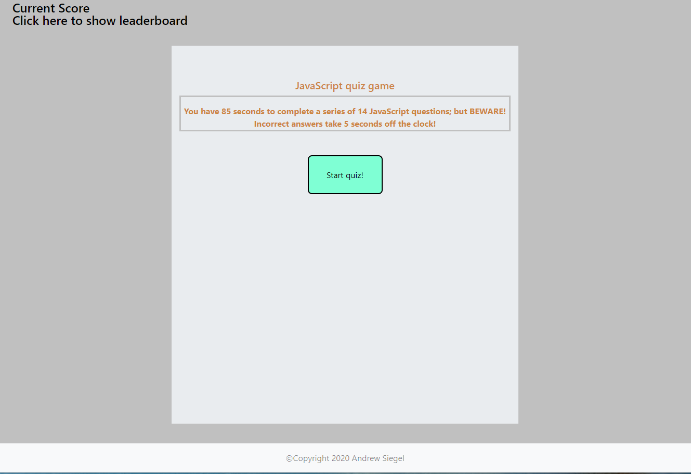

# Coding-Quiz

Welcome to my beginner JavaScript quiz! Thank you very much for checking this fun quiz out, and I hope you gain some valuable knowledge.
In writing this web app, I had quite a challenge in tieing together everything I've learned so far.

The function that I used to shuffle my array came from this article: https://www.geeksforgeeks.org/how-to-shuffle-an-array-using-javascript/; I figured rather than reinventing the wheel for that specific function, I'd go with a simple function someone already created. Originally, I had built some logic into my renderQuestions() function that would push the index of each selected questions to an array- then it would test whether that index was present in the the array before populating the question. This way each question was only asked once and it would randomize them using Math.floor(Math.random()\*length of question array). This proved much more difficult than simply shuffling the array with a seperate function before using the array of objects in renderQuestions.

BSD 3-Clause License

Copyright (c) 2020, Andrew Siegel
All rights reserved.

Redistribution and use in source and binary forms, with or without
modification, are permitted provided that the following conditions are met:

1. Redistributions of source code must retain the above copyright notice, this
   list of conditions and the following disclaimer.

2. Redistributions in binary form must reproduce the above copyright notice,
   this list of conditions and the following disclaimer in the documentation
   and/or other materials provided with the distribution.

3. Neither the name of the copyright holder nor the names of its
   contributors may be used to endorse or promote products derived from
   this software without specific prior written permission.

THIS SOFTWARE IS PROVIDED BY THE COPYRIGHT HOLDERS AND CONTRIBUTORS "AS IS"
AND ANY EXPRESS OR IMPLIED WARRANTIES, INCLUDING, BUT NOT LIMITED TO, THE
IMPLIED WARRANTIES OF MERCHANTABILITY AND FITNESS FOR A PARTICULAR PURPOSE ARE
DISCLAIMED. IN NO EVENT SHALL THE COPYRIGHT HOLDER OR CONTRIBUTORS BE LIABLE
FOR ANY DIRECT, INDIRECT, INCIDENTAL, SPECIAL, EXEMPLARY, OR CONSEQUENTIAL
DAMAGES (INCLUDING, BUT NOT LIMITED TO, PROCUREMENT OF SUBSTITUTE GOODS OR
SERVICES; LOSS OF USE, DATA, OR PROFITS; OR BUSINESS INTERRUPTION) HOWEVER
CAUSED AND ON ANY THEORY OF LIABILITY, WHETHER IN CONTRACT, STRICT LIABILITY,
OR TORT (INCLUDING NEGLIGENCE OR OTHERWISE) ARISING IN ANY WAY OUT OF THE USE
OF THIS SOFTWARE, EVEN IF ADVISED OF THE POSSIBILITY OF SUCH DAMAGE.
